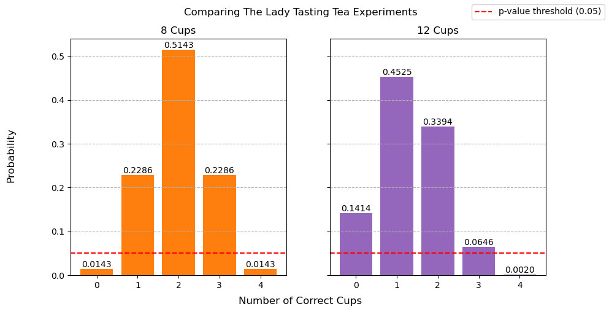
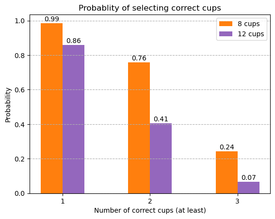

# Applied Statistics - Problems Workbook
---

This workbook contains my solutions for the applied statistics module [assessment](./docs/assessment-problems.md).

## Getting Started
---

Follow the below steps to run the [problems.ipynb](./problems.ipynb) Jupyter notebook.

### Prerequisites

Make sure you have the following installed:

- Python
- pip (Python package installer)

### Installation

1. Clone the repository.

    ```bash
    git clone https://github.com/eoghanpw/applied-statistics.git
    cd applied-statistics
    ```

2. Create and activate virtual environment.

    ```bash
    python -m venv venv
    ```
    ```bash
    .\venv\Scripts\activate.bat
    ```

3. Install dependencies.

    ```bash
    pip install -r requirements.txt
    ```

4. Install Jupyter Notebook.

    ```bash
    pip install notebook
    ```

### Running The Notebook

Launch Jupyter Notebook from the command line.

```bash
jupyter notebook
```

Once Jupyter Notebook is running, it will open a new tab in your web browser. Navigate to the directory that contains [problems.ipynb](./problems.ipynb) and click to open it.

You can run the cells by clicking on them and pressing Ctrl + Enter or alternatively, you can use the "Run" button in the toolbar.

## Usage Examples
---





## Reference Material
---

Python documentation
- [Python documentation](https://docs.python.org/3/)
- [NumPy documentation](https://numpy.org/doc/stable/user/index.html)
- [Matplotlib documentation](https://matplotlib.org/stable/users/index)
- [SciPy documentation](https://docs.scipy.org/doc/scipy/index.html)
- [Seaborn documentation](https://seaborn.pydata.org/index.html)

Lady tasting tea:
- [Irish Times](https://www.irishtimes.com/news/science/how-a-tea-tasting-test-led-to-a-breakthrough-in-statistics-1.3998786)
- [Wikipedia](https://en.wikipedia.org/wiki/Lady_tasting_tea)
- [YouTube](https://www.youtube.com/watch?v=8ERFV7rV0vg&t=901s&pp=ygUQbGFkeSB0YXN0aW5nIHRlYQ%3D%3D)

Normal distribution:
- [Wikipedia](https://en.wikipedia.org/wiki/Normal_distribution)
- [Investopedia](https://www.investopedia.com/terms/n/normaldistribution.asp)
- [khanacademy](https://www.khanacademy.org/math/statistics-probability/summarizing-quantitative-data/variance-standard-deviation-sample/a/population-and-sample-standard-deviation-review)

T-tests:
- [YouTube](https://www.youtube.com/watch?v=CIbJSX-biu0)
- [Investopedia](https://www.investopedia.com/terms/t/t-test.asp)
- [Wikipedia](https://en.wikipedia.org/wiki/P-value)

ANOVA:
- [Wikipedia](https://en.wikipedia.org/wiki/Analysis_of_variance)
- [YouTube](https://www.youtube.com/watch?v=EWYzeZbchR0&t=238s)
- [Laerd Statistics](https://statistics.laerd.com/statistical-guides/one-way-anova-statistical-guide-2.php)
- [geeksforgeeks](https://www.geeksforgeeks.org/data-science/difference-between-t-test-and-anova/)
- [Statsig](https://www.statsig.com/perspectives/control-type-i-errors)

## Author
Eoghan Walsh
